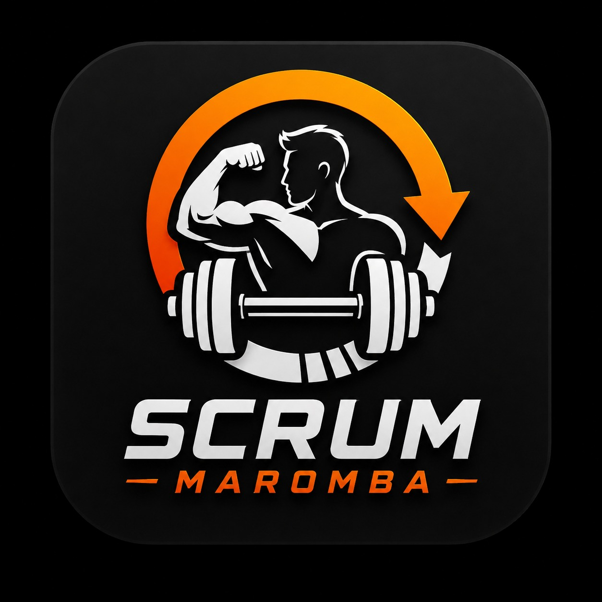

# Scrum Maromba

<p align="center">
  
</p>

## Identificação

- **Grupo:** Scrum Maromba
- **Repositório:** ScrumMaromba-2026.2
- **Disciplina:** Desenvolvimento Ágil
- **Semestre:** 2026.2
- **Instituição:** UTFPR – Campus Cornélio Procópio

## Integrantes

- **Gustavo Yudi Yamada** – https://github.com/GustavoYuYa
- **Daniel Chien Chen Wang** – https://github.com/danielchien2024
- **João Vitor de Menezes Aguiar** – https://github.com/menezzs
- **Pedro Paulo da Silva Oliveira** – https://github.com/PEDRO-067

## Descrição do Projeto

O projeto **ScrumMaromba** consiste na elaboração de uma proposta de sistema voltado ao apoio da prática de exercícios físicos. O objetivo é identificar exercícios adequados com base em informações fornecidas pelo usuário, considerando o foco muscular desejado e eventuais restrições físicas, como limitações em joelho ou lombar.

O projeto foi escolhido livremente pelo grupo e será desenvolvido no contexto da disciplina de **Desenvolvimento Ágil**, com ênfase na aplicação das práticas, artefatos e organização do processo de desenvolvimento.

## Público-Alvo

O sistema é destinado a pessoas que desejam praticar exercícios físicos e buscam sugestões compatíveis com suas características e necessidades.

## Escopo Geral

A proposta do projeto considera uma aplicação web com interface para interação do usuário. De forma geral, o sistema deverá permitir:

- informar regiões do corpo em que o usuário deseja focar;
- informar limitações ou problemas físicos relevantes;
- apresentar exercícios compatíveis com as informações fornecidas;
- permitir autenticação de usuário;
- possibilitar a visualização dos exercícios sugeridos;
- registrar a realização de exercícios.

## Documentos do Repositório

- Prototipação
- Requisitos de Usuário
- Requisitos de Sistema
- Projeto `.astah` com os diagramas do projeto

## Organização Inicial do Repositório

```text
ScrumMaromba-2026.2/
├── assets/
│   └── logo-scrum-maromba.png
├── Prototipação/
├── Requisitos de Usuário/
├── Requisitos de Sistema/
└── README.md
